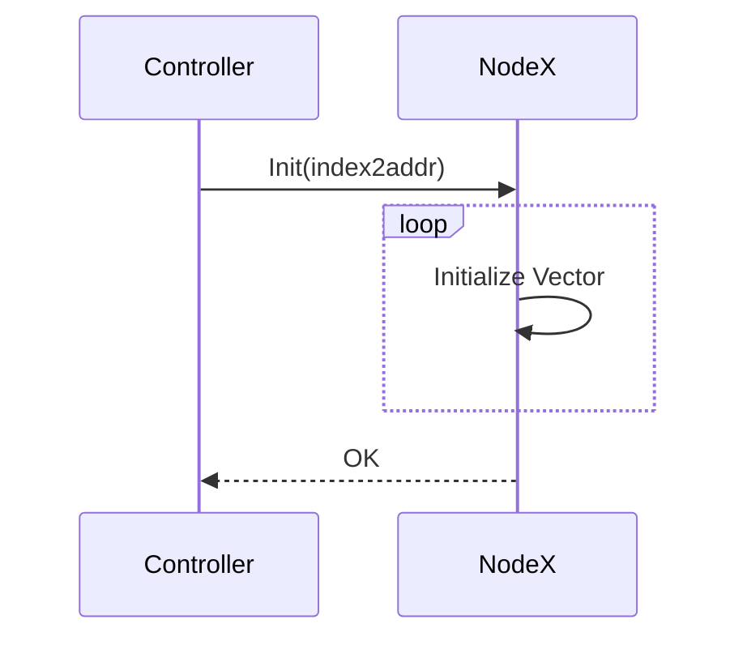
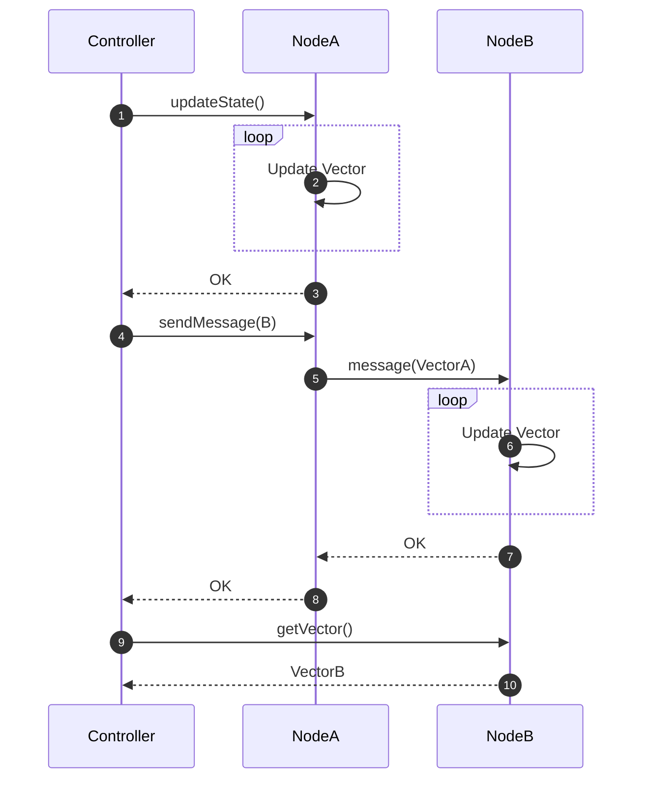
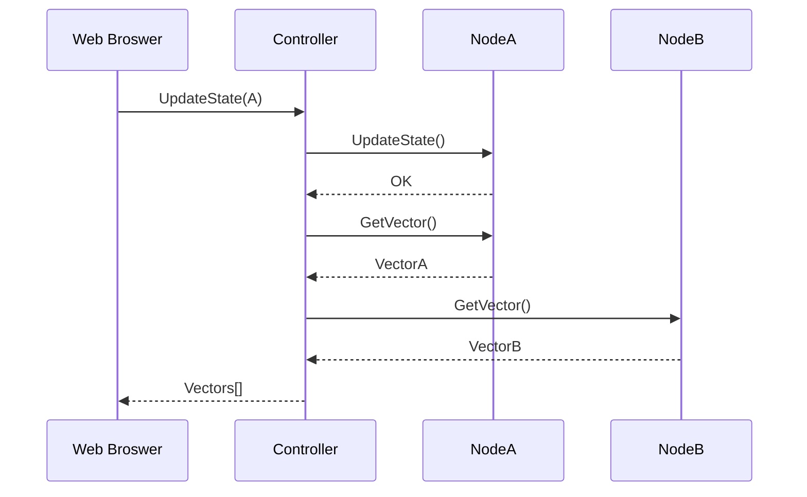

# <center>Vector Clock Implementation Based on RPC</center>


### 1. Motivation

It is well known that **logical clock**, especially **vector clock**, has become the infrastructure of modern distributed system[^1], and in such system the technique **remote procedure call** has been proposed to implement IPC over network instead of the general purpose socket[^2]. Hence in this project we're going to combine both: implement a vector clock system based on RPC.

To build the system with efficiency and utilize concurrency, we pick Golang as the implementation language of this project due to its high performance[^3], language-level multithreading support, and elegant syntax, of course.


### 2. Architecture Design

##### # Components

The traditional vector clock system consider all nodes equivalent, named as `NodeA`, `NodeB`, etc. To control all the behaviours of the entire system, we introduce an extra component named `Controller`, which is able to send control command to nodes and retrieve the current vector maintained by nodes by invoking the RPC service provided. The RPC services implemented in all the nodes are listed here:[^4]

|    RPC Service Prototype     |       C/S       |                         Description                          |
| :--------------------------: | :-------------: | :----------------------------------------------------------: |
|    `Init(index2addr map)`    | Controller/Node |   Initialize system configuration. Return `0` if success.    |
|        `GetVector()`         | Controller/Node |                  Return the current vector.                  |
|       `UpdateState()`        | Controller/Node |   Update the state of current node. Return `0` if success.   |
| `SendMessage(nodeIndex int)` | Controller/Node | Send message to node with index `nodeIndex`. Return `0` if success. |
|         `Message()`          |    Node/Node    | Update vector in current node by the received vector. Return `0` if success. |

Notice that since `Controller` is outside of the logical clock system but only a manager, the services invocation itself will not cause an state update on the provider node, expect `UpdateState()`.


##### # System Sequence Diagram

At the very beginning when nodes have started, we must inform them about the system's configuration, more precisely, a configuration map `index2addr` should be given, which maps the node index(id) to address, to **enable the communication between nodes**:

```go
type Addr struct {
	ip [4]uint8
	port uint16
}

var index2addr = map[int]Addr{
	0: {[4]uint8{127, 0, 0, 1}, 30000},
	1: {[4]uint8{127, 0, 0, 1}, 30001},
    // ...
}
```

Apparently the count of nodes `nodeCount` and the id of current node `id` can be easily inferred from this map. the service `Init(index2addr)` implemented in all nodes will be invoked by `Controller`. This sets the vector maintain in nodes as zero vector with length `nodeCount`.



After initialization, three services can be invoked by `Controller`: `updateState()`, `SendMessage(nodeIndex)`, and `getVector()`.

1. `UpdateState()` simply increase one at the entry of current node in the vector.
2. `SendMessage(nodeId)` enforce the node to invoke `Message()` service provided in node `nodeId`. That is, it aims to establish messaging process between two nodes, which leads to an vector update of the message receiver according to the vector maintained by message sender.
3. `GetVector()` return the vector in current node to `Controller`. As an informative service, it does not cause any state update.




### ==3. Exception Handling==


### 4. Implementation

With limited servers resource, nodes are implemented as different ports in one server.


### 5. Test Mechanism


### 6. User Interface

To make this simulation system easy to use and fun, we create a Web interface for the `Controller` by adding an Client/Server abstraction in `Controller` localhost. We construct an illusion that all servers are under physically control and all information is avaliable, that is, we can see the vectors holding in all nodes, implemented by envoking `GetVector()` after each state-updating invocation, `UpdateState()` and `SendMessage()`.




### 7. Further Investigation


[^1]: [Why Logical Clocks are Easy](https://queue.acm.org/detail.cfm?id=2917756)
[^2]: [RPC: Remote Procedure Call Protocol Specification Version 2](https://tools.ietf.org/html/rfc5531)
[^3]: [Concurrency in Go and Java: Performance analysis](https://ieeexplore.ieee.org/document/6920368)
[^4]: The naming convention and type hint is provided in Go-style here in the table, while it's not the actual function prototype in source code, since the `go/rpc` package requires a fix format about function as rpc service. We use the classical format here for conciseness and readability.  

