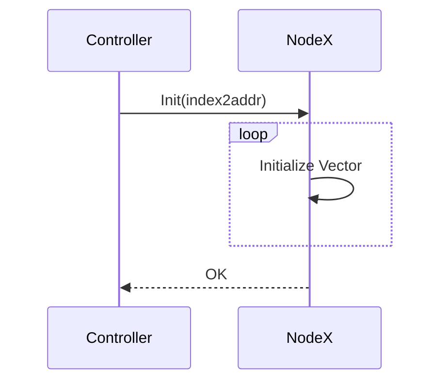
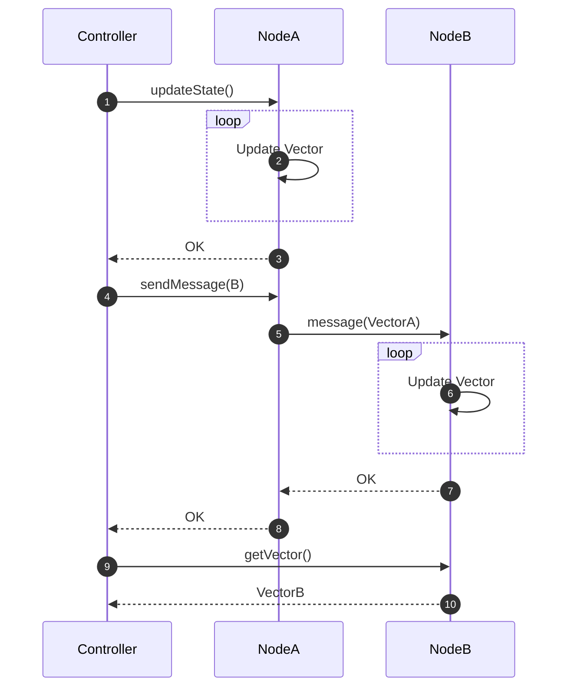

# <center>Vector Clock Implementation Based on RPC</center>

### 1. Motivation

It is well known that **logical clock**, especially **vector clock**, has become the infrastructure of modern distributed system[^1], and in such system the technique **remote procedure call** has been proposed to implement IPC over network instead of the general purpose socket[^2]. Hence in this project we're going to combine both: implement vector clocks system based on RPC. Three types of logical are implemented:

- **Casual Histories**
- **Vector Clock**
- **Version Vector**

To build the system with efficiency and utilize concurrency, we pick Golang as the implementation language of this project due to its high performance[^3], language-level multithreading support, and elegant syntax, of course.

For conciseness, we'll use vector clock as an example to illustrate the project. Similar design is also applied to other two types of logical clocks.


### 2. Architecture Design

##### # Components

The traditional vector clock system consider all nodes equivalent, named as `NodeA`, `NodeB`, etc. To control all the behaviours of the entire system, we introduce an extra component named `Controller`, which is able to send control command to nodes and retrieve the current vector maintained by nodes by invoking the RPC service provided. The RPC services implemented in all the nodes are listed here:[^4]

|    RPC Service Prototype     |       C/S       |                         Description                          |
| :--------------------------: | :-------------: | :----------------------------------------------------------: |
|    `Init(index2addr map)`    | Controller/Node | Initialize system configuration. Return the id of current node if success. |
|        `GetVector()`         | Controller/Node |                  Return the current vector.                  |
|       `UpdateState()`        | Controller/Node |   Update the state of current node. Return `0` if success.   |
| `SendMessage(nodeIndex int)` | Controller/Node | Send message to node with index `nodeIndex`. Return `0` if success. |
|         `Message()`          |    Node/Node    | Update vector in current node by the received vector. Return `0` if success. |

Notice that since `Controller` is outside of the logical clock system but only a manager, the services invocation itself will not cause an state update on the provider node, expect `UpdateState()`.


##### # System Sequence Diagram

At the very beginning when nodes have started, we must inform them about the system's configuration, more precisely, a configuration map `index2addr` should be given, which maps the node index(id) to address, to **enable the communication between nodes**:

```go
type Addr struct {
	ip [4]uint8
	port uint16
}

var id2addr = map[int]Addr{
	0: {[4]uint8{127, 0, 0, 1}, 30000},
	1: {[4]uint8{127, 0, 0, 1}, 30001},
    // ...
}
```

Apparently the count of nodes `nodeCount` and the id of current node `thisId` can be easily inferred from this map. the service `Init(index2addr)` implemented in all nodes will be invoked by `Controller`. This sets the vector maintain in nodes as zero vector with length `nodeCount`.



After initialization, three services can be invoked by `Controller`: `updateState()`, `SendMessage(nodeIndex)`, and `getVector()`.

1. `UpdateState()` simply increase one at the entry of current node in the vector.
2. `SendMessage(nodeId)` enforce the node to invoke `Message()` service provided in node `nodeId`. That is, it aims to establish messaging process between two nodes, which leads to an vector update of the message receiver according to the vector maintained by message sender.
3. `GetVector()` return the vector in current node to `Controller`. As an informative service, it does not cause any state update.




### 3. Implementation

##### # Source Code Tree

The three logical clocks are implemented in three components, `vector_clock`, `casual_history` and `version_vector`, in each component we have package `controller.go`, `node.go`, and an interactive command line tool `cli.go` are provided. The source code tree is shown as: (The details in other two folders are the same as in `vector_clock`)

```
src
├── conf
│   └── id2addr.json
├── vector_clock
│   ├── cli
│   │   └── cli.go
│   ├── controller
│   │   └── controller.go
│   └── node
│       └── node.go
├── casual_history
└── version_vector
```


##### # `go/rpc` Package

We utilize the `go/rpc`[^5] package to implement the remote precedure call.

On the server side, we define a `NodeService ` type to represent the **service** provided by node, which can be registered by `rpc.RegisterName` latter:

```go
type NodeService struct{}
rpc.RegisterName("NodeService", new(NodeService))
```

The methods provided are defined in type `NodeService`. Refer to the document of `go/rpc`, the definition of service method must be set schematically by

```go
func (t *T) MethodName(argType T1, replyType *T2) error
```

for example, for service `GetVector()`, input `T1` is redundant but required by syntax, hence we use `_` to mark the ignorance explicitly to avoid the syntax error `unused variable` in Go:

```go
func (p *NodeService) GetVector(_ int, reply *[]int) error {
	*reply = clockVector
	return nil
}
```

and on the client side, we have dial the rpc service and call `NodeService.[Method]` with parameters to invoke the service:

```go
func GetVector(id int) {
	client := rpcDial(id)

	var clockVector []int;
	err := client.Call("NodeService.GetVector", 0, &clockVector)

	if err != nil {
		log.Fatal(err)
	}

	fmt.Println(clockVector)
}
```


##### # Development Mode

The development mode has been implemented to make the project testable locally. In development mode, the self-identification of node based on the port number, instead of the IP address.


##### # User Interface: A Command Line Tool

To make this simulation interactive and fun, we provided a command line tool to manipulate the controller. All the rpc communication between controller and node can be invoked in the command line:

```shell
i(nit)		[node-id]
g(et)		[node-id]
u(pdate)	[node-id]
s(end)		[sender-node-id] [receiver-node-id]
```

To play with this interface, `node` server has to be started and listens to accept request at first. An extra command, named `c(reate)`, is provided, to run the `node` server locally based on the configuration file `conf/id2addr.conf` automatically (notice that the node service `node.go` has to be built by `go build node.go` beforehand![^6]). Here an example is given for the  interaction in vector clock:

```
>> create
5
../node/node 30003
../node/node 30004
../node/node 30000
../node/node 30001
../node/node 30002
>> init 0 
0
>> init 1
1
>> get 0
[0 0 0 0 0]
>> update 0
0
>> update 1
0
>> send 0 1
0
>> get 1
[1 2 0 0 0]
>> exit
```


### 4. Build Tutorial

1. Install Go and make sure that `go` is in your `PATH`.
2. In `src/vector_clock/node` folder, `go build node.go` to create a node executable.
3. In `src/vector_clock/cli` folder, `go build cil.go` to create a cli executable.
4. Run `cli`. The commands and their interpretations can be found above.


[^1]: [Why Logical Clocks are Easy](https://queue.acm.org/detail.cfm?id=2917756)
[^2]: [RPC: Remote Procedure Call Protocol Specification Version 2](https://tools.ietf.org/html/rfc5531)
[^3]: [Concurrency in Go and Java: Performance analysis](https://ieeexplore.ieee.org/document/6920368)
[^4]: The naming convention and type hint is provided in Go-style here in the table, while it's not the actual function prototype in source code, since the `go/rpc` package requires a fix format about function as rpc service. We use the classical format here for conciseness and readability.  

[^5]: [Package rpc](https://golang.org/pkg/net/rpc/)
[^6]: The nodes created by `c` command are built by `exec`, that is, a gorountine(thread) is create and change to another executable file. We should not utilize the go package mechanism to do this since the node server and controller is located in different hosts in production.

